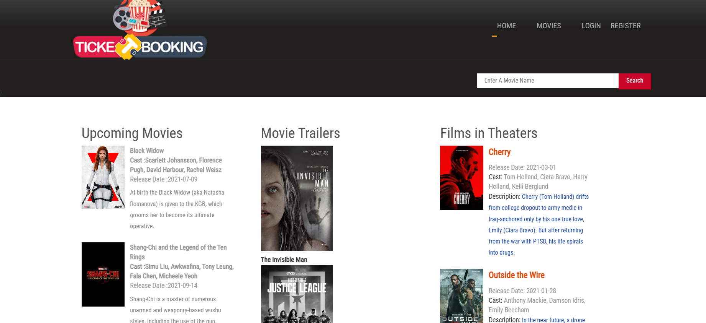
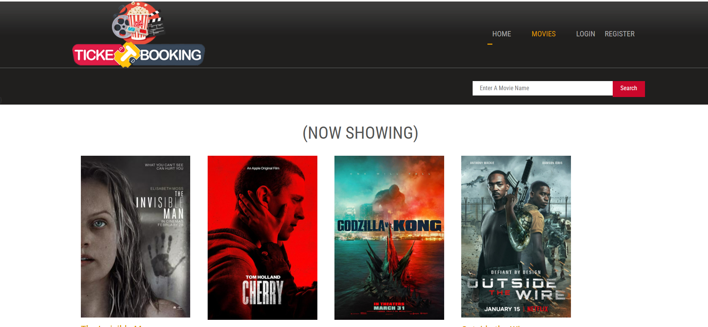
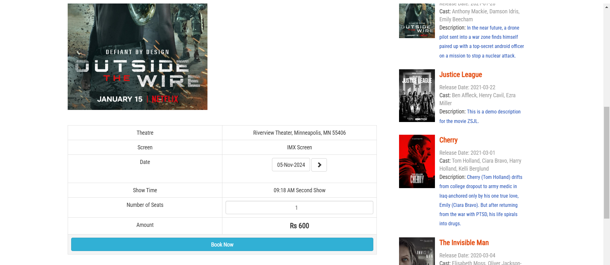
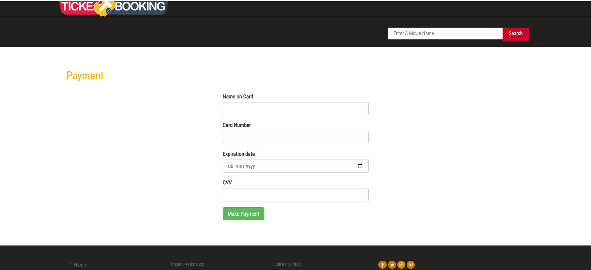
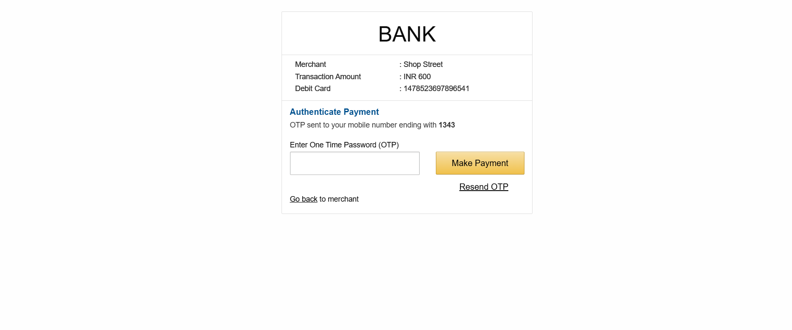

# Movie Ticket Booking System

Welcome to the **Movie Ticket Booking System** repository! This project is designed to provide users with a seamless platform for booking movie tickets online. Built using HTML, CSS, JavaScript, and PHP, this application aims to simplify the process of finding and reserving tickets for various movies.

## Project Overview

The Movie Ticket Booking System allows users to browse available movies, select showtimes, and book tickets. The application features a user-friendly interface that enhances the user experience.

### Project Features

- **User Registration & Login**: Users can create accounts and log in to manage their bookings.
- **Browse Movies**: View a list of currently available movies with details such as genre, duration, and showtimes.
- **Select Seats**: Choose seats from an interactive seating chart.
- **Secure Booking**: Complete bookings with a simple and secure process.
- **Booking History**: Users can view their past bookings.

### Project Snapshot

Here are some screenshots of the application:

 

## Technologies Used

- **Frontend**: HTML, CSS, JavaScript
- **Backend**: PHP
- **Database**: MySQL
